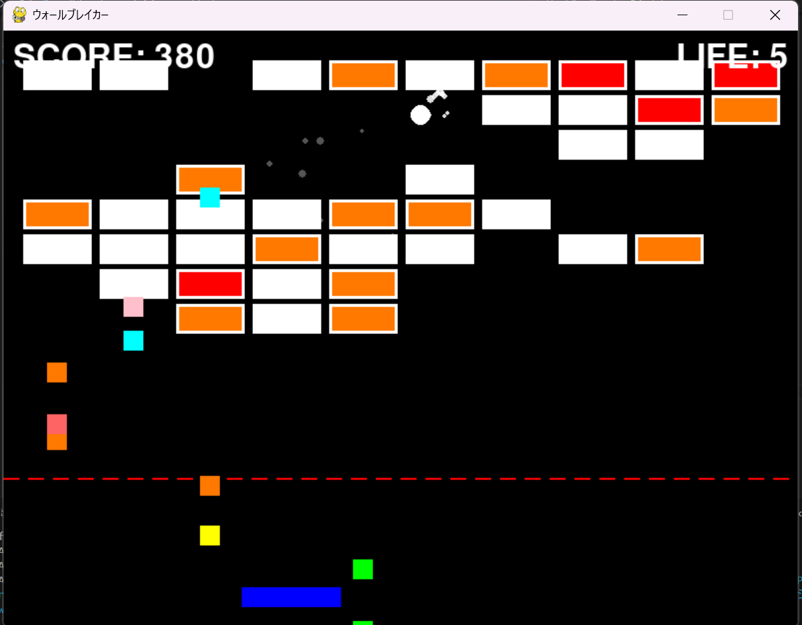

# ウォールブレイカー

## 実行環境の必要条件
* Python >= 3.10
* pygame >= 2.1

## ゲームの概要
* パドルをキーで操作し、ボールをブロックに当てて崩していく
* 高得点を目指すゲーム

## ゲームの遊び方
* ボールをパドルで跳ね返し、高得点を目指します。
* adで左右にパドルを操作
* ブロックを壊すと一定確率でアイテムを落とします

## ゲームの実装
### 共通基本機能
#### #アイテム
* ボール
* パドル
* ブロック
* ゲームオーバー画面
#### #機能
* ボール：自動で移動し、画面の上左右、ブロック、パドルにあたると反射（下端を超えると消滅）
* ブロック：ボールが当たったら消滅
* ラケット：ボール反射用
* スコア：ブロックを壊すごとに加点
* ゲームオーバー：ボールが下端を超えるとゲームオーバー

### 分担追加機能
#### 分担
* （担当：永野）：画面上部にブロック追加（ブロックが一定ラインを下回るとゲームオーバー）、各種効果音、エフェクト
* （担当：石井）：アイテムブロック（ラケット巨大化、残機増加、ボール増加）
* （担当：榎本）：アイテムブロック（貫通化、ボール巨大化）
* （担当：鳴澤）：アイテムブロック（助っ人こうかとん、爆弾ブロック）
* （担当：井上）：追加基本ブロック 耐久が高いブロックを二段階用意し、段階ごとに点数が高くなるブロックを追加。色も変えた。
### メモ
* 基本ブロックの種類：高得点/耐久
* アイテムブロック：ボール増加、貫通、巨大化、助っ人こうかとん（ランダムな一直線状のブロックを破壊）、ラケット巨大化、残機増加、爆弾（ランダム生成、ボールがぶつかると一定時間発動）
* 時間経過でボール速度変化・ブロック追加
* 残機、ゲームオーバー条件変更（ブロックが一定ラインを下回ると終了、ボール増加時はすべて下端を超えたら終了）
* エフェクト、効果音

## ToDo
* 対戦モード
* 履歴

## スクショ
